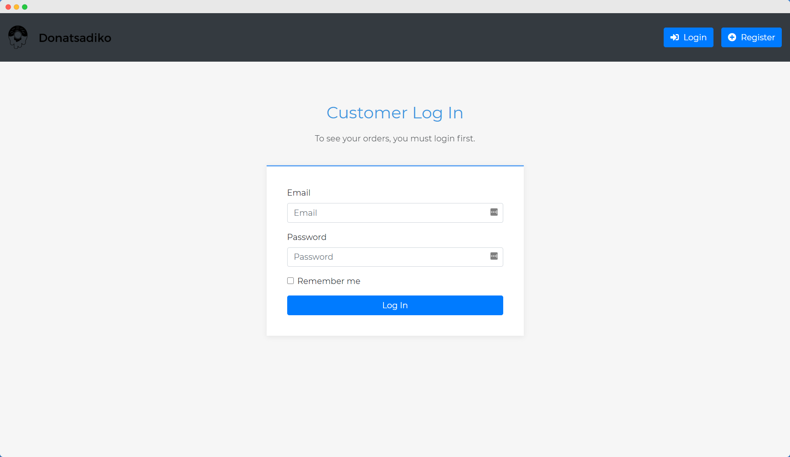

<h1 align="center">
   
  
   
  Donatsadiko Project
   
   
</h1>

<h4 align="center">A very simple Ordering Doughnuts System</h4>

  

## Installation

Upload all the files to your server, connect to your DB and you are ready!

## Contributing
Pull requests are welcome. For major changes, please open an issue first to discuss what you would like to change.

Please make sure to update tests as appropriate.

## License
The MIT License (MIT) see [License file](LICENSE)